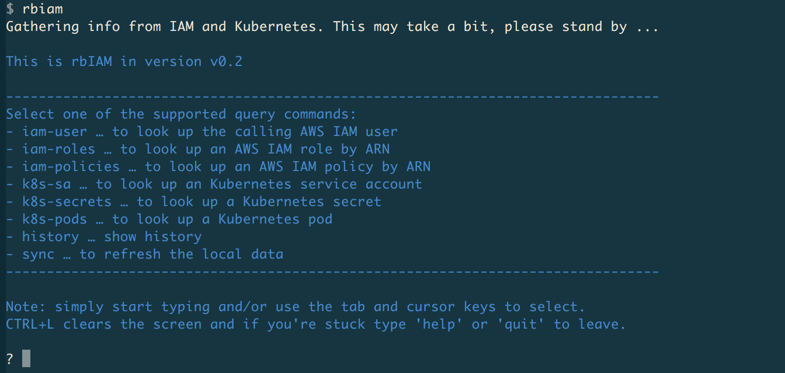
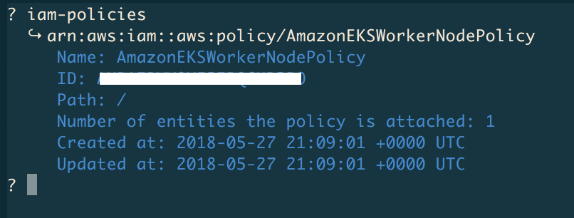
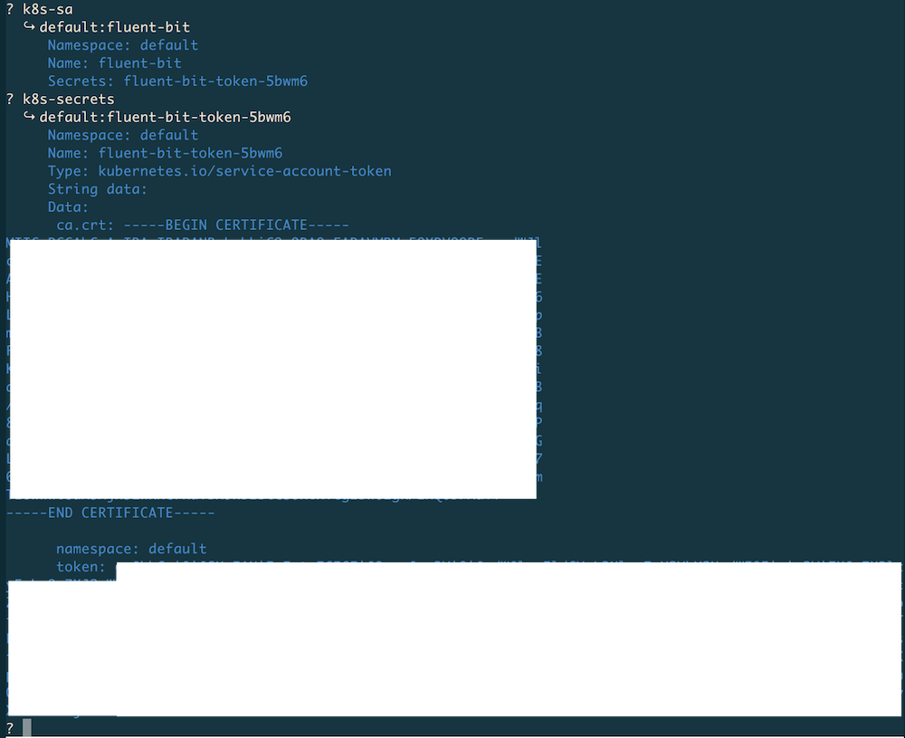

# Getting Started

!!! warning
    This tool is heavy WIP and currently the CLI binaries are available only for macOS and Linux platforms. Please [raise an issue on GitHub](https://github.com/mhausenblas/rbIAM/issues?q=is%3Aissue+is%3Aopen+sort%3Aupdated-desc) if you're experiencing problems or something does not quite work like described in here.

This guide walks you through the setup and usage of `rbIAM`.

## Prerequisites

In order for you to use `rbIAM`, the following must be true:

- You have credentials for AWS configured.
- You have access to an EKS cluster or in general an Kubernetes-on-AWS cluster.
- You have `kubectl` [installed](https://kubernetes.io/docs/tasks/tools/install-kubectl/).

## Install

To install `rbIAM` execute the following two commands. First, download
the respective binary (here shown for macOS) like so:

```sh
curl -L https://github.com/mhausenblas/rbIAM/releases/latest/download/rbiam-macos -o /usr/local/bin/rbiam
```

And then make it executable:

```sh
chmod +x /usr/local/bin/rbiam
```

!!! tip
    For Linux install, simply replace the `-macos` part with `-linux`

## Usage

The following list the command you can use and shows walks you through an example usage.

### Commands

The available commands in `rbIAM` are:

#### General

`sync` … synchronizes the local state with IAM and Kubernetes

`help` … lists available commands and provides usage tips

`quit` … terminates the interactive session and quits the program

#### IAM

`iam-user` … allows you to describe the calling AWS IAM user details

`iam-roles` … allows you to select an AWS IAM role to explore and describe its details

`iam-policies` … allows you to select an AWS IAM policy to explore and describe its details

#### Kubernetes

`k8s-pods` … allows you to select a Kubernetes pod to explore and describe its details

`k8s-sa` … allows you to select an Kubernetes service accounts to explore and describe its details

`k8s-secrets` … allows you to select a Kubernetes secret to explore and describe its details

### Walkthrough

#### Launching & terminating

After you launch the tool you should see something like this:

{: style="width:95%; display: block; margin: 10px auto 50px auto; padding: 1px; -webkit-box-shadow: -2px 0px 10px 0px rgba(0,0,0,0.4); -moz-box-shadow: -2px 0px 18px 0px rgba(0,0,0,0.4); box-shadow: -2px 0px 18px 0px rgba(0,0,0,0.4);"}

When hitting the `TAB` key or → (right arrow key) then the top-level menu appears.

{: style="width:95%; display: block; margin: 10px auto 50px auto; padding: 1px; -webkit-box-shadow: -2px 0px 10px 0px rgba(0,0,0,0.4); -moz-box-shadow: -2px 0px 18px 0px rgba(0,0,0,0.4); box-shadow: -2px 0px 18px 0px rgba(0,0,0,0.4);"}

!!! note
    Select any of the commands by navigating with the `TAB`/→ key or by start typing.
    When you start typing, only commands starting with said prefix are shown. For example,
    if you type `iam`, then the menu reduces to `iam-user`, `iam-roles` , and `iam-policies`.

Once you're done, you want to terminate `rbIAM`. To do so, start typing `q` and auto-complete 
it with `TAB` so that the `quit` command appears and when hitting `ENTER` you then execute said 
command and terminate the program.

!!! tip
    In order to clear the screen, you can hit `CTRL+L`.

#### Querying IAM user info

To learn about the logged in AWS user and caller identity, use the `iam-user`:

{: style="width:95%; display: block; margin: 10px auto 50px auto; padding: 1px; -webkit-box-shadow: -2px 0px 10px 0px rgba(0,0,0,0.4); -moz-box-shadow: -2px 0px 18px 0px rgba(0,0,0,0.4); box-shadow: -2px 0px 18px 0px rgba(0,0,0,0.4);"}

#### Exploring IAM roles & policies

If you want to learn about AWS roles, use the `iam-roles` command. Once selected,
you will see a list of IAM roles you can select from or start typing to filter
down the list. For example, here we used `eksctl` to filter down the list to two
entries and then selected one for exploration with `ENTER`:

{: style="width:95%; display: block; margin: 10px auto 50px auto; padding: 1px; -webkit-box-shadow: -2px 0px 10px 0px rgba(0,0,0,0.4); -moz-box-shadow: -2px 0px 18px 0px rgba(0,0,0,0.4); box-shadow: -2px 0px 18px 0px rgba(0,0,0,0.4);"}

!!! tip
    In order to clear the term to the left of the cursor, you can hit `CTRL+W`.

To learn about AWS policies, use the `iam-policies` command.

{: style="width:95%; display: block; margin: 10px auto 50px auto; padding: 1px; -webkit-box-shadow: -2px 0px 10px 0px rgba(0,0,0,0.4); -moz-box-shadow: -2px 0px 18px 0px rgba(0,0,0,0.4); box-shadow: -2px 0px 18px 0px rgba(0,0,0,0.4);"}


#### Exploring Kubernetes pods

Starting off with your app, you want to explore an Kubernetes pod. For this, use
the `k8s-pods` command as follows:

{: style="width:95%; display: block; margin: 10px auto 50px auto; padding: 1px; -webkit-box-shadow: -2px 0px 10px 0px rgba(0,0,0,0.4); -moz-box-shadow: -2px 0px 18px 0px rgba(0,0,0,0.4); box-shadow: -2px 0px 18px 0px rgba(0,0,0,0.4);"}

Now that we have the pod info, we can continue with the service account we found
here, in this case `fluent-bit`.

#### Exploring Kubernetes service accounts & secrets

To explore Kubernetes service accounts and their secrets, use the `k8s-sa` and 
the `k8s-secrets` command, respectively. From the previous step we've gathered
that for the Fluent Bit pod we're interested in the service account `fluent-bit` 
so let's look this up along with its secret:

{: style="width:95%; display: block; margin: 10px auto 50px auto; padding: 1px; -webkit-box-shadow: -2px 0px 10px 0px rgba(0,0,0,0.4); -moz-box-shadow: -2px 0px 18px 0px rgba(0,0,0,0.4); box-shadow: -2px 0px 18px 0px rgba(0,0,0,0.4);"}

!!! note
    Values in secrets are `base64` encoded, however `rbIAM` automatically converts
    them into clear text so that you can directly copy & paste them. For example,
    in the case shown above, the value of `ca.cert` would be the actual content of
    the certificate.