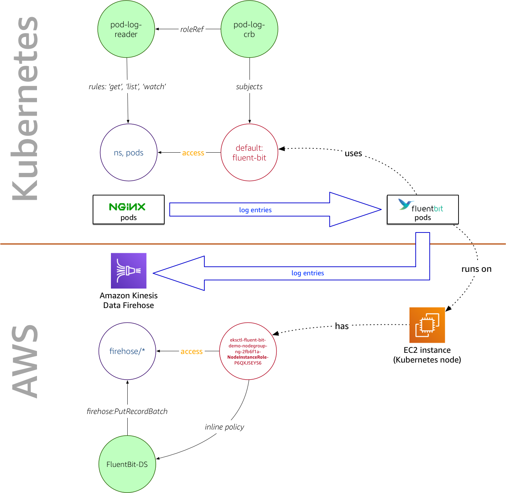

# Overview

When using Amazon Elastic Kubernetes Service ([EKS](https://aws.amazon.com/eks/)) you will at some point ask yourself: how does AWS Identity and Access Management ([IAM](https://aws.amazon.com/iam/)) and Kubernetes Role-based access control ([RBAC](https://kubernetes.io/docs/reference/access-authn-authz/rbac/)) play together. Do they overlap? Are they complementary? What are the dependencies?

`rbIAM` aims to help you navigate this space.

If you want to learn more about the Why then read on here. For more background, peruse the [terminology](terminology/), and otherwise check out the [getting started](getting-started/) guide now.

## Motivation 

Let's have a look at a concrete example, for motivation. Take the [Fluent Bit output plugin for Amazon Kinesis Data Firehose](https://github.com/aws/amazon-kinesis-firehose-for-fluent-bit). In [Centralized Container Logging with Fluent Bit](https://aws.amazon.com/blogs/opensource/centralized-container-logging-fluent-bit/) we described how to use it.

The setup, on a high level, is as follows:

{: style="width:95%; display: block; margin: 30px auto 50px auto; padding: 20px 50px 20px 50px; -webkit-box-shadow: -2px 0px 10px 0px rgba(0,0,0,0.4); -moz-box-shadow: -2px 0px 18px 0px rgba(0,0,0,0.4); box-shadow: -2px 0px 18px 0px rgba(0,0,0,0.4);"}

The Fluent Bit is deployed as a `DaemonSet` as per [eks-fluent-bit-daemonset.yaml](https://github.com/aws-samples/amazon-ecs-fluent-bit-daemon-service/blob/master/eks/eks-fluent-bit-daemonset.yaml) and:

1. depends on an IAM policy, defined in [eks-fluent-bit-daemonset-policy.json](https://github.com/aws-samples/amazon-ecs-fluent-bit-daemon-service/blob/master/eks/eks-fluent-bit-daemonset-policy.json), giving it the permissions to write to the Kinesis Data Firehose, manage log streams in CloudWatch, etc., as well as
1. a Kubernetes role, defined in [eks-fluent-bit-daemonset-rbac.yaml](https://github.com/aws-samples/amazon-ecs-fluent-bit-daemon-service/blob/master/eks/eks-fluent-bit-daemonset-rbac.yaml), giving it the permissions to list and query pods and namespaces, in the cluster, so that it can receive the logs from the containers.

Taken together, it looks as follows:

{: style="width:95%; display: block; margin: 30px auto 50px auto; padding: 20px 50px 20px 50px; -webkit-box-shadow: -2px 0px 10px 0px rgba(0,0,0,0.4); -moz-box-shadow: -2px 0px 18px 0px rgba(0,0,0,0.4); box-shadow: -2px 0px 18px 0px rgba(0,0,0,0.4);"}

The Fluent Bit plugin has, through the Kubernetes RBAC settings in the `pod-log-reader` role, the permission to read the logs of the NGINX pods and, due to the fact that it is running on an EC2 instance with an AWS IAM role `eksctl-fluent-bit-demo-nodegroup-ng-2fb6f1a-NodeInstanceRole-P6QXJ5EYS6` that has an inline policy attached, allowing it to write the log entries to a Kinesis Data Firehose delivery stream.

For a finer-grained description of the many moving parts here, have a look at the [terminology](terminology/) section, which defines the terms and explains the motivational example in detail.

## Use cases

You want to use `rbIAM` for:

- Exploring a given permissions setup, for example, an existing deployment in Kubernetes, when using EKS.
- Find the necessary permissions for a desired setup, both for the IAM policies and the RBAC roles.
- Understand how AWS services, such as S3 or CloudWatch or Firehose interact with Kubernetes resources, such as pods, from an access control perspective.
- Look up what a given Kubernetes resource can or can not do, concerning AWS services.

We expect that infra admins admins, devops roles, and also developers can 
benefit from `rbIAM`. In order to use the tool, we assume you're familiar with 
both AWS IAM and Kubernetes RBAC. If you want to brush up your knowledge, we
recommend first having a look at the [terminology](terminology/) section.