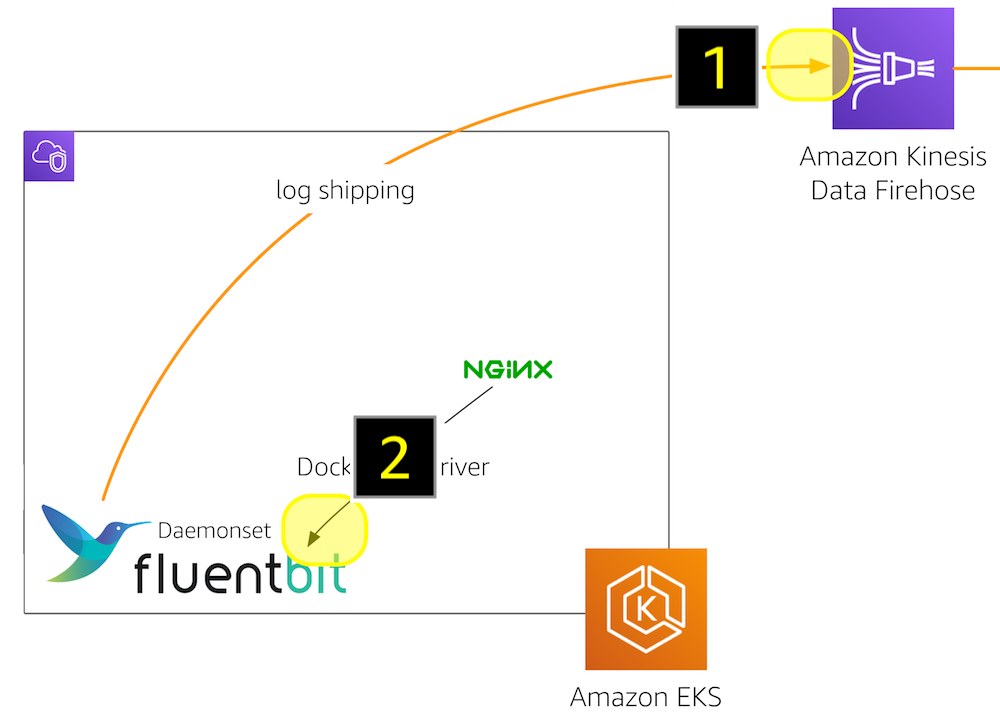

# Overview

When using Amazon Elastic Kubernetes Service ([EKS](https://aws.amazon.com/eks/)) you will at some point ask yourself: how does AWS Identity and Access Management ([IAM](https://aws.amazon.com/iam/)) and Kubernetes Role-based access control ([RBAC](https://kubernetes.io/docs/reference/access-authn-authz/rbac/)) play together. Do they overlap? Are they complementary? Are there dependencies.

`rbIAM` aims to help you navigate this space.

## Motivation 

Let's have a look at a concrete example, for motivation. Take the [Fluent Bit output plugin for Amazon Kinesis Data Firehose](https://github.com/aws/amazon-kinesis-firehose-for-fluent-bit). In [Centralized Container Logging with Fluent Bit](https://aws.amazon.com/blogs/opensource/centralized-container-logging-fluent-bit/) we described how to use it. The setup, in a nutshell, is as follows:

The Fluent Bit is deployed as a `DaemonSet` as per [eks-fluent-bit-daemonset.yaml](https://github.com/aws-samples/amazon-ecs-fluent-bit-daemon-service/blob/master/eks/eks-fluent-bit-daemonset.yaml) and:

1. depends on an IAM policy, defined in [eks-fluent-bit-daemonset-policy.json](https://github.com/aws-samples/amazon-ecs-fluent-bit-daemon-service/blob/master/eks/eks-fluent-bit-daemonset-policy.json), giving it the permissions to write to the Kinesis Data Firehose, manage log streams in CloudWatch, etc., as well as
1. a Kubernetes role, defined in [eks-fluent-bit-daemonset-rbac.yaml](https://github.com/aws-samples/amazon-ecs-fluent-bit-daemon-service/blob/master/eks/eks-fluent-bit-daemonset-rbac.yaml), giving it the permissions to list and query pods and namespaces, in the cluster, so that it can receive the logs from the containers.

## Terminology

### IAM

Principal

:   An entity in AWS able to carry out an action and/or access a resource. The  
    entity can be an [account root user](https://docs.aws.amazon.com/IAM/latest/UserGuide/id_root-user.html), an [IAM user](https://docs.aws.amazon.com/IAM/latest/UserGuide/id_users.html), or a **role**.

Role

:   An entity that, in contrast to an IAM user or root user which are uniquely associated with a person, is intended to be assumable by someone. A role does not have long-term credentials, but rather, when assuming a role, it provides you with [temporary security credentials](https://docs.aws.amazon.com/IAM/latest/UserGuide/id_credentials_temp.html) for the duration of a session.

Policy

:   A JSON document using the [IAM policy language](https://docs.aws.amazon.com/IAM/latest/UserGuide/reference_policies.html) that either defines actions and resources a **role** can use (permissions policy) or define who is allowed to assume a **role**, in which case the trusted entity is included in the policy as the **principal** (trust policy).

### RBAC

User

:   A human being that is using Kubernetes, either via CLI tools such as 
    `kubectl`, using the HTTP API of the API server, or via apps.

Service account

:   Represents processes running in pods that wish to interact with the API     
    server.

Role

:   Defines a set of strictly additive rules, representing a set of permissions.

Role binding

:   Grants the permissions defined in a **role** to an entity (user, group, or      service account).

For example:

