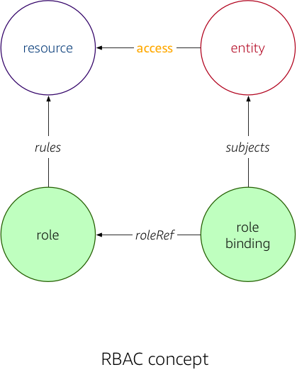
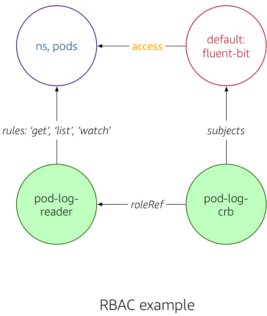

# Terminology

## AWS Identity and Access Management (IAM) { #markdown data-toc-label='IAM' }

Conceptually, AWS IAM looks as follows:

*TBD*

Principal

:   An entity in AWS able to carry out an action and/or access a resource. The  
    entity can be an [account root user](https://docs.aws.amazon.com/IAM/latest/UserGuide/id_root-user.html), an [IAM user](https://docs.aws.amazon.com/IAM/latest/UserGuide/id_users.html), or a **role**.

Role

:   An entity that, in contrast to an IAM user or root user which are uniquely associated with a person, is intended to be assumable by someone. A role does not have long-term credentials, but rather, when assuming a role, it provides you with [temporary security credentials](https://docs.aws.amazon.com/IAM/latest/UserGuide/id_credentials_temp.html) for the duration of a session.

Policy

:   A JSON document using the [IAM policy language](https://docs.aws.amazon.com/IAM/latest/UserGuide/reference_policies.html) that either defines actions and resources a **role** can use (permissions policy) or define who is allowed to assume a **role**, in which case the trusted entity is included in the policy as the **principal** (trust policy).

For example, for our Fluent Bit output plugin deployed as a `DaemonSet`, the RBAC regime looks as follows:

*TBD*

## Kubernetesd Role-based Access Control (RBAC) { #markdown data-toc-label='RBAC' }

Conceptually, Kubernetes RBAC looks as follows:

{: style="width:400px; display: block; margin: 30px auto 50px auto; padding: 30px 50px 10px 50px; -webkit-box-shadow: -2px 0px 10px 0px rgba(0,0,0,0.4); -moz-box-shadow: -2px 0px 18px 0px rgba(0,0,0,0.4); box-shadow: -2px 0px 18px 0px rgba(0,0,0,0.4);"}

The access an entity has concerning a resource is determined through two indirections: roles (define access rules) and role binding (attach or bind a role to an entity). More formally:

Entity

:   A user, group, or a Kubernetes [service account](https://kubernetes.io/docs/reference/access-authn-authz/service-accounts-admin/).

User

:   A human being that is using Kubernetes, either via CLI tools such as 
    `kubectl`, using the HTTP API of the API server, or indirectly, via cloud native apps.

Service account

:   Represents processes running in pods that wish to interact with the
    API server; a namespaced Kubernetes resource, representing the identity of an app.

Resource

:   A Kubernetes abstraction, representing operational aspects. Can be 
    namespaced, for example a pod (co-scheduled containers), a service (east-west load balancer), or a deployment (pod supervisor for app life cycle management) or cluster-wide, such as nodes or namespaces themselves.

Role

:   Defines a set of strictly additive rules, representing a set of permissions.
    These permissions define what actions an **entity** is allowed to carry out
    with respect to a set of resources. Can be namespaced (then the role is only valid in the context of said namespace) or cluster wide.

Role binding

:   Grants the permissions defined in a **role** to an **entity**. Can be
    namespaced (then the binding is only valid in the context of said namespace
    or cluster wide. Note that it is perfectly possible and even desirable to define a cluster-wide role and then used a (namespaced) role binding. This allows straight-forward re-use of roles across namespaces.

For example, for our Fluent Bit output plugin deployed as a `DaemonSet`, the RBAC regime looks as follows:

{: style="width:430px; display: block; margin: 30px auto 50px auto; padding: 30px 60px 10px 50px; -webkit-box-shadow: -2px 0px 10px 0px rgba(0,0,0,0.4); -moz-box-shadow: -2px 0px 18px 0px rgba(0,0,0,0.4); box-shadow: -2px 0px 18px 0px rgba(0,0,0,0.4);"}

In a nutshell: the Fluent Bit output plugin, using the `default:fluent-bit` service account, is permitted to read and list pods in the default namespace.