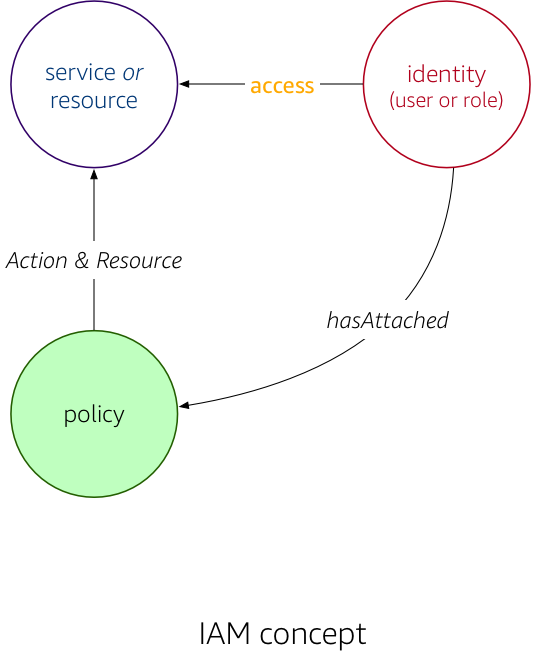
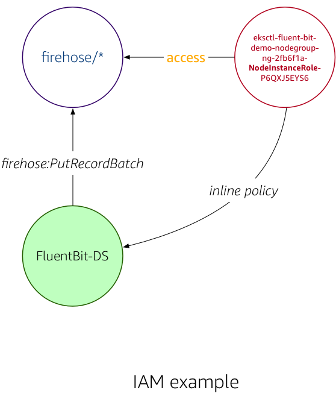

# Terminology

In the following we define the terms used in AWS IAM and Kubernetes RBAC, along with the [motivational example](../#motivation), to illustrate what exactly each term means.

## AWS Identity and Access Management (IAM) { #markdown data-toc-label='IAM terms' }

Conceptually, AWS IAM looks as follows: the **access** an identity—such as a user or role—has concerning an AWS service or resource is determined through the attached policies that list allowed actions on resources. 

{: style="width:95%; display: block; margin: 30px auto 50px auto; padding: 20px 50px 20px 50px; -webkit-box-shadow: -2px 0px 10px 0px rgba(0,0,0,0.4); -moz-box-shadow: -2px 0px 18px 0px rgba(0,0,0,0.4); box-shadow: -2px 0px 18px 0px rgba(0,0,0,0.4);"}

More formally, we're using the following terms:

Principal

:   An identity in AWS able to carry out an action offered by an AWS service
    (like listing EC2 instances) or able access a resource (such as reading from an S3 bucket). The identity can be an [account root user](https://docs.aws.amazon.com/IAM/latest/UserGuide/id_root-user.html), an [IAM user](https://docs.aws.amazon.com/IAM/latest/UserGuide/id_users.html), or a **role**.

Role

:   An identity that—in contrast to an IAM user/root user, which are uniquely 
    associated with a person—is intended to be assumable by someone (person) or something (service). A role doesn't have long-term credentials, but rather, when assuming a role, [temporary security credentials](https://docs.aws.amazon.com/IAM/latest/UserGuide/id_credentials_temp.html) are provided, for the duration of a session.

Policy

:   A JSON document using the [IAM policy language](https://docs.aws.amazon.com/IAM/latest/UserGuide/reference_policies.html) that either:
    
    1. defines allowed actions on resources (services) a **role** can use (permissions policy), or
    
    1. defines who is allowed to **assume a role**, in which case the trusted entity is included in the policy as the **principal** (trust policy).

For example, for our Fluent Bit output plugin deployed as a `DaemonSet` in EKS, one of the IAM regimes looks as follows (compare: [IAM policy used](https://github.com/aws-samples/amazon-ecs-fluent-bit-daemon-service/blob/6bf267b5c750de7df94a0553f0dde9e5c1e4d75a/eks/eks-fluent-bit-daemonset-policy.json#L5)):

{: style="width:95%; display: block; margin: 30px auto 50px auto; padding: 20px 50px 20px 50px; -webkit-box-shadow: -2px 0px 10px 0px rgba(0,0,0,0.4); -moz-box-shadow: -2px 0px 18px 0px rgba(0,0,0,0.4); box-shadow: -2px 0px 18px 0px rgba(0,0,0,0.4);"}

In a nutshell: the Fluent Bit output plugin, running in a container part of a pod that is running on an EC2 instance part of a node group with a role `eksctl-fluent-bit-demo-nodegroup-ng-2fb6f1a-NodeInstanceRole-P6QXJ5EYS6` is permitted to perform the `PutRecordBatch` action in Firehose; in fact, with said policy, the Fluent Bit plugin is allowed to put records into *any* delivery stream, since the resource has not been limited to a specific one.

## Kubernetes Role-based Access Control (RBAC) { #markdown data-toc-label='RBAC terms' }

Conceptually, Kubernetes RBAC looks as follows: the **access** an entity—such as a user or service account—has concerning a Kubernetes resource is determined through two indirections: roles (which define access rules) and role bindings (attaching or binding a role to an entity). 

{: style="width:95%; display: block; margin: 30px auto 50px auto; padding: 20px 50px 20px 50px; -webkit-box-shadow: -2px 0px 10px 0px rgba(0,0,0,0.4); -moz-box-shadow: -2px 0px 18px 0px rgba(0,0,0,0.4); box-shadow: -2px 0px 18px 0px rgba(0,0,0,0.4);"}

More formally, we're using the following terms:

Entity

:   A user, group, or a Kubernetes [service account](https://kubernetes.io/docs/reference/access-authn-authz/service-accounts-admin/).

User

:   A human being that is using Kubernetes, either via CLI tools such as 
    `kubectl`, using the HTTP API of the API server, or indirectly, via cloud native apps.

Service account

:   Represents processes running in pods that wish to interact with the
    API server; a namespaced Kubernetes resource, representing the identity of an app.

Resource

:   A Kubernetes abstraction, representing operational aspects. Can be 
    namespaced, for example a pod (co-scheduled containers), a service (east-west load balancer), or a deployment (pod supervisor for app life cycle management) or cluster-wide, such as nodes or namespaces themselves.

Role

:   Defines a set of strictly additive rules, representing a set of permissions.
    These permissions define what actions an **entity** is allowed to carry out
    with respect to a set of resources. Can be namespaced (then the role is only valid in the context of said namespace) or cluster wide.

Role binding

:   Grants the permissions defined in a **role** to an **entity**. Can be
    namespaced (then the binding is only valid in the context of said namespace)
    or cluster wide. Note that it is perfectly possible and even desirable to define a cluster-wide role and then use a (namespaced) role binding. This allows straight-forward re-use of roles across namespaces.

For example, for our Fluent Bit output plugin deployed as a `DaemonSet` in EKS, the RBAC regime looks as follows (compare: [role & role binding used](https://github.com/aws-samples/amazon-ecs-fluent-bit-daemon-service/blob/master/eks/eks-fluent-bit-daemonset-rbac.yaml)):

{: style="width:95%; display: block; margin: 30px auto 50px auto; padding: 20px 60px 20px 40px; -webkit-box-shadow: -2px 0px 10px 0px rgba(0,0,0,0.4); -moz-box-shadow: -2px 0px 18px 0px rgba(0,0,0,0.4); box-shadow: -2px 0px 18px 0px rgba(0,0,0,0.4);"}

In a nutshell: the Fluent Bit output plugin, using the `default:fluent-bit` service account, is permitted to read and list pods in the default namespace.